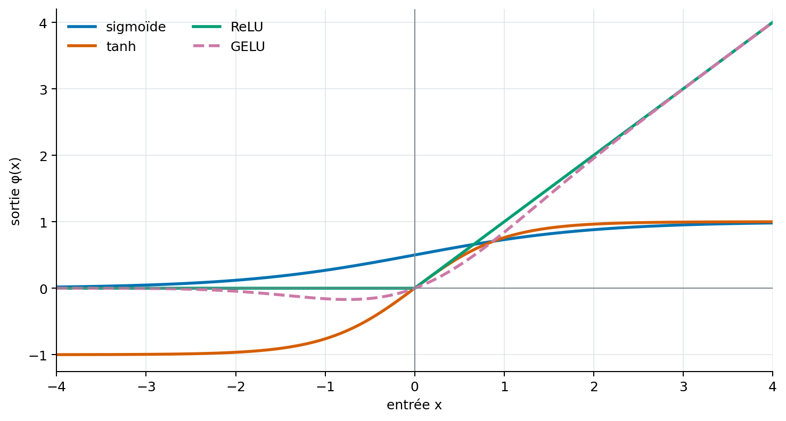
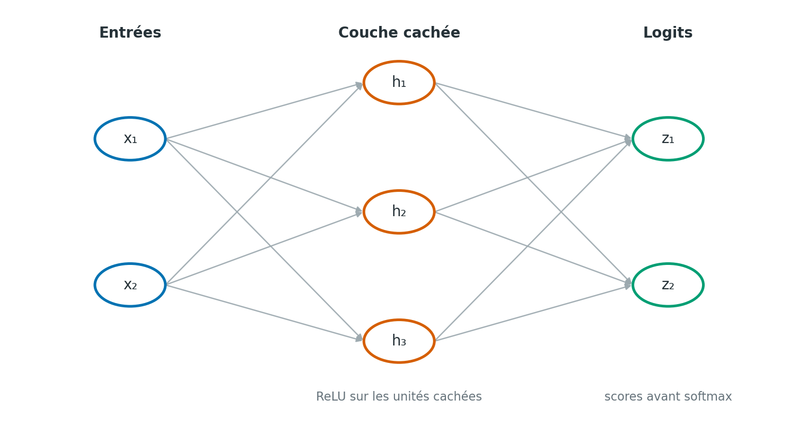

# Réseaux neuronaux : perceptron, propagation avant et rétropropagation

> **Statut :** premier jet; sources externes à vérifier; PDF de CI inspecté le 2026-10-01.\
> **Date de rédaction :** 2026-10-01\
> **Prérequis :** vecteurs, matrices, dérivées et descente de gradient

## Objectifs

À la fin du chapitre, tu pourras :

- calculer la sortie d’un neurone artificiel;
- expliquer pourquoi un perceptron simple ne suffit pas pour toute classification;
- suivre la propagation avant dans un petit réseau multicouche;
- comprendre comment la règle de chaîne propage les gradients vers les premières couches;
- calculer une mise à jour de poids sur un exemple simple.

## En une phrase

Un réseau neuronal compose des transformations affines et des fonctions non linéaires; la propagation avant calcule une prédiction, puis la rétropropagation calcule comment chaque paramètre a contribué à l’erreur.

## Du neurone au perceptron

Un neurone artificiel reçoit (d) nombres d’entrée (x_1,\ldots,x_d), leur associe des poids (w_1,\ldots,w_d), puis ajoute un biais (b). Il calcule d’abord une somme affine (z), puis applique une fonction d’activation (phi) :

\[
z=\mathbf{w}^{\mathsf T}\mathbf{x}+b
\qquad\text{et}\qquad
a=\phi(z)
\]

Ici, \(\mathbf{x}\in\mathbb{R}^d\) est le vecteur d’entrée, \(\mathbf{w}\in\mathbb{R}^d\) le vecteur de poids, \(b\) le biais, \(z\) le score avant activation et \(a\) la sortie. Le biais décale le seuil de réponse; les poids règlent l’influence des entrées. Cette opération est une petite transformation affine suivie d’une non-linéarité. [Goodfellow, Bengio et Courville (2016)](#ref-goodfellow2016)

Un **perceptron** de classification applique une activation seuil. Avec la convention ci-dessous, il prédit la classe 1 dès que le score est positif ou nul :

\[
\hat y=\begin{cases}
1 & \text{si }z\geq 0,\\
0 & \text{si }z<0.
\end{cases}
\]

La frontière entre les deux classes vérifie \(\mathbf{w}^{\mathsf T}\mathbf{x}+b=0\). Pour deux entrées, c’est une droite; pour un nombre plus élevé de dimensions, c’est un hyperplan. Le modèle peut apprendre une frontière linéaire, mais il ne peut pas séparer toutes les configurations possibles. [Rosenblatt (1958)](#ref-rosenblatt1958) [Goodfellow, Bengio et Courville (2016)](#ref-goodfellow2016)

Par exemple, la fonction XOR vaut 1 lorsque exactement une des deux entrées vaut 1. Ses deux exemples positifs occupent des coins opposés du carré; aucune droite unique ne sépare ces coins des deux coins négatifs. Il faut construire des représentations intermédiaires, ce qu’une couche cachée peut permettre.

Pour des étiquettes \(y\in\{0,1\}\), la règle d’apprentissage classique du perceptron peut s’écrire :

\[
\mathbf{w}\leftarrow\mathbf{w}+\eta(y-\hat y)\mathbf{x},
\qquad
b\leftarrow b+\eta(y-\hat y)
\]

Le nombre \(\eta>0\) est le taux d’apprentissage. Si la prédiction est correcte, l’erreur \(y-\hat y\) est nulle et ces paramètres ne changent pas pour cet exemple. Cette règle entraîne un classifieur à seuil; elle n’est pas la rétropropagation utilisée pour entraîner les réseaux profonds.

## Pourquoi ajouter des couches et des activations

Une suite de transformations linéaires reste équivalente à une seule transformation linéaire. Entre les transformations, il faut donc une fonction non linéaire pour que les couches apprennent des frontières et des représentations plus riches. [Goodfellow, Bengio et Courville (2016)](#ref-goodfellow2016)

| Activation | Définition | Comportement et usage |
|---|---|---|
| Sigmoïde | \(1/(1+e^{-x})\) | Sortie (0, 1); pente faible loin de 0. |
| Tangente hyperbolique | \(\tanh(x)\) | Sortie (−1, 1), centrée en 0; saturation aux extrémités. |
| ReLU | \(\max(0,x)\) | Nulle à gauche de 0; égale à x à droite. |
| GELU | \(x\Phi(x)\) | Activation lisse; petite sortie pour certaines entrées négatives. |

La sigmoïde peut représenter une probabilité binaire en sortie. Pour la GELU, \(\Phi\) est la fonction de répartition normale standard [Hendrycks et Gimpel (2016)](#ref-hendrycks2016gelu). La figure compare les quatre formes sur le même intervalle. Les courbes sont calculées par le script du dépôt; elles illustrent des fonctions mathématiques, pas une mesure expérimentale.

 
*Figure 11.1 — Formes de quatre fonctions d’activation. Identifiant : `fig-03-activations-01`; tracé original généré par `scripts/generate_figures.py` avec Matplotlib 3.10.8; aucune donnée expérimentale.*

La sigmoïde et \(\tanh\) ont une dérivée proche de zéro loin de leur zone centrale; le produit répété de ces dérivées peut rendre les gradients très faibles dans les premières couches. ReLU évite cette saturation du côté positif, mais son gradient vaut zéro du côté négatif. En \(x=0\), ReLU n’est pas dérivable au sens classique; les bibliothèques utilisent une convention de sous-gradient. Le choix d’activation dépend donc du réseau et de son objectif, et aucune fonction n’est meilleure dans tous les cas. [Goodfellow, Bengio et Courville (2016)](#ref-goodfellow2016)

## Propagation avant dans un réseau multicouche

Une couche dense applique la même transformation affine à toutes ses sorties. Pour la couche \(\ell\), on note \(\mathbf{a}^{(\ell-1)}\) ses entrées, \(\mathbf{W}^{(\ell)}\) ses poids et \(\mathbf{b}^{(\ell)}\) ses biais :

\[
\mathbf{z}^{(\ell)}=\mathbf{W}^{(\ell)}\mathbf{a}^{(\ell-1)}+\mathbf{b}^{(\ell)},
\qquad
\mathbf{a}^{(\ell)}=\phi\!\left(\mathbf{z}^{(\ell)}\right)
\]

Si la couche précédente a \(n_{\ell-1}\) unités et la couche courante \(n_\ell\), alors \(\mathbf{W}^{(\ell)}\) a la forme \(n_\ell\times n_{\ell-1}\); le vecteur de biais et le vecteur de sortie ont chacun \(n_\ell\) éléments. Les couches cachées transforment les entrées. La dernière couche peut produire des **logits**, c’est-à-dire des scores réels avant leur conversion en probabilités.

Le diagramme représente un réseau entièrement connecté à deux entrées, trois unités cachées et deux sorties. Les biais ne sont pas dessinés; dans cet exemple, ReLU s’applique aux unités cachées et la dernière couche transmet les logits.

 
*Figure 11.2 — Propagation avant dans un petit réseau multicouche. Identifiant : `fig-03-mlp-01`; schéma original généré par `scripts/generate_figures.py` avec Matplotlib 3.10.8.*

### Exemple numérique : deux entrées et deux classes

Prenons \(\mathbf{x}=[1,2]^{\mathsf T}\), une couche cachée de deux unités et une sortie de deux logits :

\[
\mathbf{W}^{(1)}=\begin{bmatrix}1&-1\\0{,}5&1\end{bmatrix},
\quad
\mathbf{b}^{(1)}=\begin{bmatrix}0\\0{,}5\end{bmatrix},
\quad
\mathbf{W}^{(2)}=\begin{bmatrix}1&-0{,}5\\-1&0{,}25\end{bmatrix},
\quad
\mathbf{b}^{(2)}=\begin{bmatrix}0{,}2\\0\end{bmatrix}
\]

La première couche donne \(\mathbf{z}^{(1)}=[-1,3]^{\mathsf T}\). Après ReLU, \(\mathbf{a}^{(1)}=[0,3]^{\mathsf T}\). La deuxième couche produit les logits \(\mathbf{z}^{(2)}=[-1{,}3,0{,}75]^{\mathsf T}\). Pour obtenir des probabilités, on peut appliquer softmax :

\[
p_k=\frac{e^{z_k}}{\sum_j e^{z_j}}
\]

Ici, les probabilités sont environ \([0{,}114,\;0{,}886]\); le modèle attribue donc le score le plus élevé à la deuxième classe. Le calcul utilise les logits avant softmax et arrondit les probabilités à trois décimales.

## Rétropropagation : calculer les contributions à l’erreur

La rétropropagation applique la règle de chaîne de la dernière couche vers les premières. Elle calcule le gradient de la fonction de perte par rapport aux activations, aux poids et aux biais. L’algorithme calcule ces dérivées; une règle d’optimisation distincte, telle que la descente de gradient, décide ensuite comment modifier les paramètres. [Rumelhart, Hinton et Williams (1986)](#ref-rumelhart1986) [Goodfellow, Bengio et Courville (2016)](#ref-goodfellow2016)

Pour une couche cachée \(\ell\), le terme \(\boldsymbol{\delta}^{(\ell)}\) représente la dérivée de la perte par rapport à ses scores \(\mathbf{z}^{(\ell)}\). En notant \(\odot\) la multiplication coordonnée par coordonnée et \(\phi'\) la dérivée de l’activation, le gradient se propage vers l’arrière ainsi :

\[
\boldsymbol{\delta}^{(\ell)}=
\left(\mathbf{W}^{(\ell+1)}\right)^{\mathsf T}
\boldsymbol{\delta}^{(\ell+1)}\odot
\phi'\!\left(\mathbf{z}^{(\ell)}\right),
\qquad
\frac{\partial L}{\partial\mathbf{W}^{(\ell)}}=
\boldsymbol{\delta}^{(\ell)}\left(\mathbf{a}^{(\ell-1)}\right)^{\mathsf T}
\]

Le produit par la transposée des poids ramène l’information de l’erreur vers les unités précédentes; le produit par \(\phi'\) tient compte de l’activation. Pour un lot de plusieurs exemples, les gradients correspondants sont ensuite agrégés selon la convention de réduction de la perte.

### Exemple calculé : un neurone caché

Considérons un réseau avec une entrée \(x=2\), une unité cachée ReLU et une sortie linéaire. Ses paramètres sont \(w_1=0{,}5\), \(b_1=0{,}1\), \(w_2=2\) et \(b_2=0{,}2\). La cible est \(y=3\), et la perte quadratique vaut \(L=\tfrac12(\hat y-y)^2\).

La propagation avant donne \(z_1=w_1x+b_1=1{,}1\), \(h=\max(0,z_1)=1{,}1\) et \(\hat y=w_2h+b_2=2{,}4\). La perte est \(L=0{,}18\). Comme \(z_1>0\), la dérivée de ReLU dans cet exemple vaut 1. En appliquant la règle de chaîne :

\[
\frac{\partial L}{\partial w_2}=(\hat y-y)h=-0{,}66,
\quad
\frac{\partial L}{\partial b_2}=\hat y-y=-0{,}6,
\quad
\frac{\partial L}{\partial w_1}=(\hat y-y)w_2x=-2{,}4,
\quad
\frac{\partial L}{\partial b_1}=(\hat y-y)w_2=-1{,}2
\]

Avec un taux \(\eta=0{,}01\), la mise à jour \(\theta\leftarrow\theta-\eta\nabla_\theta L\) donne \(w_1=0{,}524\), \(b_1=0{,}112\), \(w_2=2{,}0066\) et \(b_2=0{,}206\). Après cette mise à jour, la sortie vaut environ \(2{,}534\) et la perte \(0{,}109\). Cet exemple vérifie numériquement les signes et l’effet d’une étape; il ne garantit pas qu’un taux ou une étape quelconque réduira toujours la perte.

## Pourquoi cela compte pour les LLM

Un Transformer contient des matrices de poids, des biais ou paramètres de normalisation et des activations non linéaires. Lors du préentraînement, le modèle calcule d’abord les logits et la perte sur les tokens observés, puis la rétropropagation mesure la contribution des paramètres à cette perte. L’optimiseur utilise ces gradients pour les mettre à jour. Le mécanisme s’applique à des réseaux beaucoup plus grands; les prochains chapitres détailleront l’attention, les blocs Transformer, les lots et les fonctions de perte utilisées pour la prédiction du prochain token.

## Limites et pièges

- Une activation seuil est non différentiable à son seuil; elle n’est pas le choix ordinaire pour entraîner un réseau profond avec descente de gradient.
- Ajouter des couches sans activation non linéaire ne rend pas le modèle plus expressif qu’une transformation linéaire unique.
- La rétropropagation calcule des gradients, mais ne choisit ni le taux d’apprentissage ni la règle d’optimisation.
- Un gradient exact de la perte d’entraînement ne prouve pas que le modèle généralisera à des données nouvelles.
- Les dérivées peuvent devenir très petites ou grandes dans des réseaux profonds; les architectures modernes utilisent notamment des activations, normalisations et chemins résiduels adaptés à ces difficultés.
- Une couche, une activation ou une réduction de perte peut modifier les formes et les échelles des gradients; il faut vérifier les dimensions et les conventions du calcul.

## Exercices

1. Pour \(\mathbf{x}=[-1,2]^{\mathsf T}\), \(\mathbf{w}=[3,-1]^{\mathsf T}\) et \(b=0{,}5\), calcule \(z\) et la sortie ReLU.
2. Un perceptron commence avec \(\mathbf{w}=[0,0]^{\mathsf T}\), \(b=-0{,}1\), reçoit \(\mathbf{x}=[1,2]^{\mathsf T}\) avec la cible \(y=1\). En utilisant le seuil \(z\geq0\) et \(\eta=0{,}1\), calcule sa prédiction, puis ses paramètres après une mise à jour.
3. Explique pourquoi un seul perceptron à frontière linéaire ne peut pas classer correctement les quatre points de XOR.

### Corrigé succinct

1. \(z=3(-1)-2+0{,}5=-4{,}5\); ReLU renvoie 0.
2. Le score initial est −0,1, donc \(\hat y=0\). L’erreur vaut 1 et la mise à jour donne \(\mathbf{w}=[0{,}1,0{,}2]^{\mathsf T}\), \(b=0\).
3. Les points positifs de XOR occupent des coins opposés; aucune droite ne peut les séparer simultanément des deux autres coins. Une représentation non linéaire intermédiaire est nécessaire.

## À retenir

Un neurone transforme une entrée par une somme pondérée, un biais et une activation. Les couches composent ces opérations pour produire des représentations et des prédictions. La propagation avant calcule les sorties; la rétropropagation applique la règle de chaîne pour obtenir les gradients; l’optimiseur s’en sert ensuite pour mettre à jour les paramètres.

## Références

### Rosenblatt (1958) {#ref-rosenblatt1958}

- Frank Rosenblatt. “The Perceptron: A Probabilistic Model for Information Storage and Organization in the Brain.” *Psychological Review*, 65(6), 386–408, 1958. [DOI](https://doi.org/10.1037/h0042519).

### Rumelhart, Hinton et Williams (1986) {#ref-rumelhart1986}

- David E. Rumelhart, Geoffrey E. Hinton et Ronald J. Williams. “Learning representations by back-propagating errors.” *Nature*, 323, 533–536, 1986. [DOI](https://doi.org/10.1038/323533a0).

### Goodfellow, Bengio et Courville (2016) {#ref-goodfellow2016}

- Ian Goodfellow, Yoshua Bengio et Aaron Courville. *Deep Learning*. MIT Press, 2016. Chapitres 6 et 8. [Livre et chapitres en ligne](https://www.deeplearningbook.org/).

### Hendrycks et Gimpel (2016) {#ref-hendrycks2016gelu}

- Dan Hendrycks et Kevin Gimpel. “Gaussian Error Linear Units (GELUs).” arXiv:1606.08415, 2016. [Prépublication](https://arxiv.org/abs/1606.08415).
