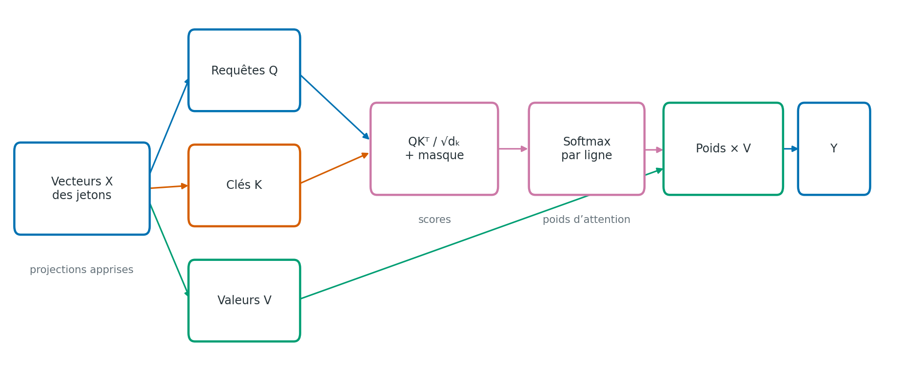

# Attention : requêtes, clés et valeurs

> **Statut :** premier jet; source externe à vérifier et rendu PDF de CI à inspecter.\
> **Date de rédaction :** 2026-10-01\
> **Prérequis :** vecteurs, matrices, produits scalaires et probabilités

## Objectifs

À la fin du chapitre, tu pourras :

- distinguer requêtes, clés et valeurs dans un calcul d’attention;
- calculer les poids d’attention pour une petite séquence;
- expliquer l’effet du facteur d’échelle et du masque causal;
- reconnaître le coût quadratique de l’attention dense standard.

## En une phrase

L’attention compare une représentation de chaque position aux clés des autres positions, transforme ces scores en poids, puis combine les valeurs correspondantes.

## Une représentation par jeton

Un texte est d’abord découpé en jetons, puis chaque jeton est représenté par un vecteur numérique. Un chapitre ultérieur détaillera la tokenisation, les tables d’embeddings et l’information de position; ici, on suppose que la séquence est déjà une matrice

\[
X\in\mathbb{R}^{n\times d_{\mathrm{model}}}
\]

où \(n\) est le nombre de positions et \(d_{\mathrm{model}}\) la largeur de leurs représentations. Une ligne correspond à un jeton. Le mécanisme d’attention transforme ces vecteurs en requêtes \(Q\), clés \(K\) et valeurs \(V\) au moyen de matrices de paramètres apprises :

\[
Q=XW_Q,\qquad K=XW_K,\qquad V=XW_V.
\]

Pour une seule tête, on peut choisir \(W_Q,W_K\in\mathbb{R}^{d_{\mathrm{model}}\times d_k}\) et \(W_V\in\mathbb{R}^{d_{\mathrm{model}}\times d_v}\). Les formes obtenues sont \(Q,K\in\mathbb{R}^{n\times d_k}\) et \(V\in\mathbb{R}^{n\times d_v}\). Les matrices de projection permettent au réseau d’apprendre quels aspects des représentations comparer et quelles informations mélanger. [Vaswani et al. (2017)](#ref-vaswani2017)

Les mots « requête », « clé » et « valeur » sont une analogie inspirée d’une recherche dans un dictionnaire : une requête est comparée à des clés et les valeurs correspondantes sont récupérées. Dans le réseau, ce sont simplement trois projections apprises; elles ne contiennent pas nécessairement une question ou une étiquette humaine explicite.

 
*Figure 12.1 — Projections Q/K/V, scores, normalisation et somme pondérée. Identifiant : `fig-04-qkv-attention-01`; schéma original généré par `scripts/generate_figures.py` avec Matplotlib 3.10.8.*

## Scores, masque et poids

Le produit \(QK^{\mathsf T}\) compare chaque requête à toutes les clés. Il donne une matrice \(n\times n\) : l’élément \((i,j)\) mesure la compatibilité entre la position qui demande de l’information \(i\) et la position qui en propose \(j\). Le mécanisme d’attention à produit scalaire mis à l’échelle est :

\[
\operatorname{Attention}(Q,K,V)=
\operatorname{softmax}\!\left(\frac{QK^{\mathsf T}}{\sqrt{d_k}}+M\right)V.
\]

La softmax est appliquée séparément à chaque ligne; les poids d’une requête somment donc à 1. Le diviseur \(\sqrt{d_k}\) limite l’augmentation typique de l’amplitude des produits scalaires avec la largeur \(d_k\). Sous une hypothèse simplifiée de composantes indépendantes et de variance unitaire, la somme de \(d_k\) produits a une variance qui croît avec \(d_k\); la mise à l’échelle maintient les scores à une grandeur plus stable avant softmax.

La matrice \(M\) est facultative selon la tâche. Une entrée égale à \(0\) laisse le score inchangé; une entrée égale à \(-\infty\) rend le poids correspondant nul après softmax. Un masque peut ainsi interdire certaines positions, notamment les jetons futurs dans un modèle autorégressif.

### Exemple numérique avec trois positions

Considérons une requête à la position 2, trois clés et trois valeurs projetées :

\[
q_2=[0,1],\quad k_1=[1,0],\quad k_2=[0,1],\quad k_3=[1,1],
\qquad d_k=2.
\]

Les scores mis à l’échelle sont \([0,1/\sqrt{2},1/\sqrt{2}]\). Pour une prédiction causale à la position 2, la position 3 est future et le masque transforme le dernier score en \(-\infty\). La softmax donne alors environ \([0{,}33,0{,}67,0]\). Avec

\[
v_1=[1,0],\qquad v_2=[0,2],\qquad v_3=[10,10],
\]

la sortie d’attention est

\[
0{,}33v_1+0{,}67v_2+0v_3\approx[0{,}33,1{,}34].
\]

La valeur future \(v_3\) n’influence pas le résultat, même si elle est présente dans le calcul matriciel. Les poids et le résultat sont arrondis à deux décimales; le calcul utilise la softmax exacte des deux scores autorisés.

## Masque causal et attention croisée

Pour prédire le jeton suivant, la position \(i\) peut utiliser le contexte jusqu’à \(i\), mais pas les positions futures \(j>i\). Le masque triangulaire inférieur correspondant a des entrées autorisées sur et sous la diagonale. Sans ce masque, un modèle pourrait consulter la réponse qu’il doit prédire pendant son entraînement.

L’**auto-attention** construit Q, K et V à partir de la même séquence. Dans l’**attention croisée**, les requêtes viennent d’une séquence, tandis que les clés et valeurs viennent d’une autre. Dans l’architecture encodeur-décodeur d’origine, les requêtes du décodeur consultent ainsi les représentations produites par l’encodeur. [Vaswani et al. (2017)](#ref-vaswani2017)

## Plusieurs têtes

Une tête effectue une seule comparaison apprise. L’attention multi-tête exécute plusieurs projections en parallèle, puis combine leurs sorties :

\[
\operatorname{head}_r=\operatorname{Attention}(XW^Q_r,XW^K_r,XW^V_r),
\qquad
\operatorname{MHA}(X)=\operatorname{Concat}(\operatorname{head}_1,\ldots,\operatorname{head}_h)W^O.
\]

Les têtes peuvent apprendre des pondérations différentes; il n’est toutefois pas garanti qu’une tête corresponde à un rôle linguistique simple. Dans la configuration classique, les dimensions des têtes sont choisies pour que leur concaténation retrouve la largeur du modèle. D’autres choix existent selon l’architecture.

## Coût et portée

Pour une séquence de longueur \(n\), le calcul dense forme des scores pour les \(n^2\) paires de positions. Sa complexité de calcul est de l’ordre de \(n^2d_{\mathrm{model}}\); pendant l’entraînement, les scores ou poids d’attention peuvent aussi occuper une mémoire proportionnelle à \(h n^2\) par exemple et par couche, où \(h\) est le nombre de têtes. Les détails dépendent des noyaux logiciels et de ce qu’ils conservent en mémoire. Des algorithmes plus efficaces réduisent le coût ou l’empreinte dans certaines configurations, mais le calcul dense standard reste quadratique en longueur.

Les poids d’attention décrivent la combinaison calculée à une couche. Pris seuls, ils ne constituent pas une explication fiable de toutes les décisions du modèle : les projections, les autres têtes, les couches suivantes et les connexions résiduelles contribuent aussi au résultat.

## Limites et pièges

- Les poids d’attention sont relatifs aux projections apprises; ils ne mesurent pas une similarité universelle entre deux mots.
- Sans encodage de position ou autre signal d’ordre, l’attention seule ne sait pas distinguer une permutation de la séquence.
- L’attention causale interdit de voir le futur, mais ne rend pas automatiquement les sorties exactes ou fiables.
- L’attention dense standard compare toutes les paires de positions; la longueur de contexte influence donc fortement le coût.
- Les poids ne forment une distribution que sur les positions autorisées, et les conventions de masque varient selon les bibliothèques.

## Exercice

Une requête de dimension 2 vaut \(q=[1,0]\). Les clés sont \(k_1=[1,0]\), \(k_2=[0,1]\) et \(k_3=[-1,0]\). Sans masque, calcule les scores mis à l’échelle pour \(d_k=2\), puis indique la position à laquelle la softmax attribue le plus de poids.

### Corrigé succinct

Les scores sont \([1/\sqrt{2},0,-1/\sqrt{2}]\), soit environ \([0{,}707,0,-0{,}707]\). La première clé a le score le plus élevé; la softmax lui attribue donc le poids le plus grand.

## À retenir

L’attention transforme des représentations en requêtes, clés et valeurs, compare chaque requête aux clés, normalise les scores et calcule une somme pondérée des valeurs. Le masque contrôle quelles positions sont visibles; le masque causal empêche un modèle de langage de consulter le futur. Les têtes parallèles offrent plusieurs projections, au prix d’un calcul dense qui croît quadratiquement avec la longueur de séquence.

## Références

### Vaswani et al. (2017) {#ref-vaswani2017}

- Ashish Vaswani et al. “Attention Is All You Need.” *Advances in Neural Information Processing Systems*, 30, 2017. [Article](https://arxiv.org/abs/1706.03762).
