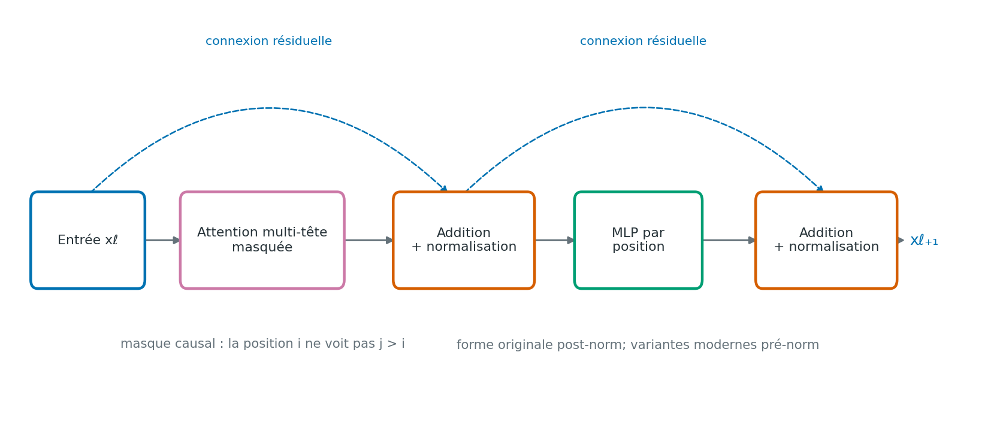

# Architecture Transformer, encodeur, décodeur et variantes

> **Statut :** premier jet; source externe à vérifier; PDF de CI inspecté le 2026-10-01.\
> **Date de rédaction :** 2026-10-01\
> **Prérequis :** [attention Q/K/V](attention-qkv.md), vecteurs et rétropropagation

## Objectifs

À la fin du chapitre, tu pourras :

- situer les embeddings et le signal de position dans le flot de calcul;
- décrire le rôle des sous-couches d’attention, du réseau feed-forward et des connexions résiduelles;
- distinguer l’encodeur-décodeur original d’un décodeur causal seul;
- calculer un petit nombre de paramètres pour un bloc Transformer illustratif.

## En une phrase

Un Transformer répète des blocs qui mélangent l’information entre positions par l’attention, puis transforment chaque position par un réseau feed-forward.

## Des jetons aux représentations

Un tokenizer transforme le texte en identifiants discrets \(t_1,\ldots,t_n\). Une table d’embeddings associe à chaque identifiant un vecteur appris; on note \(E[t_i]\) la ligne correspondante. Dans le Transformer original, on ajoute un vecteur de position \(P_i\) :

\[
x_i^{(0)}=E[t_i]+P_i.
\]

Les positions sont nécessaires parce que l’attention, sans autre signal d’ordre, traite les représentations comme un ensemble de vecteurs et ne sait pas distinguer les permutations. L’article original utilise des encodages sinusoïdaux; d’autres architectures apprennent des embeddings de position ou introduisent la position d’une autre manière. Les variantes modernes ne suivent donc pas toutes exactement cette addition. [Vaswani et al. (2017)](#ref-vaswani2017)

 
*Figure 13.1 — Attention causale, connexions résiduelles, normalisation et réseau feed-forward d’un bloc décodeur. Le dessin suit la forme post-norm originale; les implémentations modernes emploient souvent une variante pré-norm. Identifiant : `fig-04-decoder-block-01`; schéma original généré par `scripts/generate_figures.py` avec Matplotlib 3.10.8.*

## Les deux sous-couches d’un bloc

Une couche d’attention permet à chaque position de composer une représentation à partir d’autres positions permises par le masque. Le mécanisme Q/K/V est détaillé dans le [chapitre sur l’attention](attention-qkv.md). Dans un bloc encodeur, l’auto-attention peut généralement consulter toute la séquence source. Dans un décodeur autorégressif, l’auto-attention est masquée pour que la position \(i\) ne voie pas les positions futures.

La deuxième sous-couche est un réseau feed-forward appliqué indépendamment à chaque position. Dans la forme classique, il élargit d’abord la représentation, applique une non-linéarité, puis la ramène à la largeur du modèle :

\[
\operatorname{FFN}(x)=\phi(xW_1+b_1)W_2+b_2.
\]

L’attention mélange l’information entre positions; le FFN transforme chaque position sans mélanger directement les jetons entre eux. Les connexions résiduelles ajoutent l’entrée d’une sous-couche à sa sortie. Une normalisation stabilise les représentations. L’article original place la normalisation après l’addition résiduelle (forme **post-norm**); nombre de modèles plus récents la placent avant la sous-couche (forme **pré-norm**) et peuvent employer une normalisation différente. Il faut donc lire la description de l’architecture plutôt que supposer un ordre universel. [Vaswani et al. (2017)](#ref-vaswani2017)

## Encodeur-décodeur original

L’architecture de l’article original comprend deux piles :

1. **Encodeur.** Chaque bloc combine auto-attention non causale et FFN, avec additions résiduelles et normalisations.
2. **Décodeur.** Chaque bloc applique une auto-attention masquée, une attention croisée vers les sorties de l’encodeur, puis un FFN. L’attention croisée utilise les représentations du décodeur comme requêtes et les sorties de l’encodeur comme clés et valeurs.
3. **Projection de sortie.** Une projection produit des scores pour les jetons possibles; une softmax les transforme en probabilités.

Le décodeur reçoit les jetons cibles décalés d’une position pendant l’entraînement. Ainsi, sa position \(i\) prédit le jeton suivant en ne consultant que le préfixe disponible. Ce décalage et le masque causal préviennent tous deux les fuites de la cible.

## Décodeur causal seul

De nombreux modèles de langage utilisent une pile de décodeur causal sans encodeur séparé. Les jetons du prompt entrent dans les mêmes blocs masqués; chaque position produit des logits sur le vocabulaire. À l’entraînement, on minimise en général la log-vraisemblance négative du jeton suivant :

\[
L=-\frac{1}{n-1}\sum_{i=1}^{n-1}\log p_\theta(t_{i+1}\mid t_1,\ldots,t_i).
\]

Le modèle voit le préfixe jusqu’à \(i\), calcule une distribution sur le vocabulaire et reçoit comme cible \(t_{i+1}\). À l’inférence, le jeton choisi est ajouté au contexte pour former le préfixe suivant; le calcul détaillé du décodage et du cache KV sera traité plus loin.

Un encodeur seul, un décodeur seul et une architecture encodeur-décodeur sont donc des choix distincts, adaptés à des objectifs différents. « Transformer » désigne la famille de blocs et de mécanismes; il ne signifie pas nécessairement que le modèle contient à la fois un encodeur et un décodeur.

## Exemple de comptage de paramètres

Considérons un bloc décodeur pédagogique avec \(d_{\mathrm{model}}=4\), une tête de largeur 4, une couche intermédiaire de largeur \(d_{\mathrm{ff}}=8\), des biais dans chaque projection linéaire et deux normalisations LayerNorm de largeur 4. Le compte illustratif est :

| Composant | Calcul | Paramètres |
|---|---:|---:|
| Projections Q, K, V et sortie | \(4\times(4\cdot4+4)\) | 80 |
| FFN, couches 4→8 puis 8→4 | \((4\cdot8+8)+(8\cdot4+4)\) | 76 |
| Deux LayerNorm (gain et biais) | \(2\times(4+4)\) | 16 |
| **Total du bloc illustratif** | \(80+76+16\) | **172** |

Le total exclut les embeddings, la projection vers le vocabulaire, les paramètres partagés, ainsi que les variantes sans biais ou utilisant une autre normalisation. Il illustre comment les dimensions déterminent le nombre de paramètres; ce n’est pas le compte d’un modèle commercial ou publié.

## Limites et pièges

- Un masque causal bloque les positions futures, mais ne définit ni le tokenizer ni l’objectif d’entraînement à lui seul.
- Les embeddings positionnels additifs de la forme originale ne décrivent pas toutes les méthodes modernes de représentation de la position.
- L’ordre post-norm/pré-norm, la normalisation, la largeur du FFN et le nombre de têtes varient selon les familles de modèles.
- Le compte des paramètres d’un bloc n’est pas le compte total d’un modèle : il faut ajouter les embeddings, la tête de sortie et les autres blocs, en tenant compte du partage éventuel.
- Le nombre de paramètres seul ne permet pas de déduire la mémoire d’exécution, la vitesse ou la qualité d’un modèle.

## Exercice

Dans un bloc de décodeur avec \(d_{\mathrm{model}}=8\), une tête de largeur 8 et un FFN de largeur 16, chaque projection linéaire possède un biais. Combien de paramètres ont les quatre matrices d’attention Q, K, V et sortie? Ignore les normalisations.

### Corrigé succinct

Chaque projection compte \(8\cdot8+8=72\) paramètres. Les quatre projections comptent donc \(4\cdot72=288\) paramètres.

## À retenir

Les embeddings donnent des vecteurs aux jetons, tandis qu’un signal de position renseigne le modèle sur leur ordre. Chaque bloc combine attention entre positions et FFN par position, généralement avec des chemins résiduels et une normalisation. Le Transformer original est encodeur-décodeur; un LLM causal peut utiliser seulement un décodeur masqué et prédire le jeton suivant.

## Références

### Vaswani et al. (2017) {#ref-vaswani2017}

- Ashish Vaswani et al. “Attention Is All You Need.” *Advances in Neural Information Processing Systems*, 30, 2017. [Article](https://arxiv.org/abs/1706.03762).
